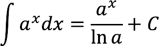

# Решение определенного интеграла показательной и степенной функции  

## Язык программирования C#
-------------------------------------------------------------------
### Код 
```c#
public string Degree { get; set; }= "";
public string Base { get; set; }= "";

public double OpredIntegral()
{
	if((Degree == "")||(Base == ""))
	{
		return InvalidOperationException("Не введены данные")
	}
	else{
	if((Degree == "x")||(Degree == "X"))
	{
		double basee = Convert.ToDouble(Base);
		return ((Math.Pow(basee, a) / Math.Log(basee)) - ((Math.Pow(basee, b) / Math.Log(basee))));
	}
	else
	{
		double deg = Convert.Todouble(Degree);
		if (deg == -1)
		{
			return InvalidOperationException("Показатель степени = -1")
		}
		else
		{
			return ((Math.Pow(a, deg + 1) / (deg + 1) - ((Math.Pow(b, deg + 1) / (deg + 1)))));
		}
	}
}

public double InvalidOperationException(string v)
{
	throw new NotImplementedException();
}

```
#### Объяснение переменных

***Degree*** - степень (*Глобальная переменная. Тип данных string*)  
**Base** - ~~степень~~ основание (*Глобальная переменная. Тип данных string*)
*a* - нижний предел интегрирования (*Тип данных double*)
*b* - верхний предел интегрирования (*Тип данных double*)

##### Разбор кода

1. Проверка на "пустоту" вышеперечилсенных переменных
    1. Если да, то вывод ошибки
    1. Если нет - пропуск.
   ```c#
   if((Degree == "")||(Base == ""))
	{
		return InvalidOperationException("Не введены данные")
	}
   ```
1. Проверка на показательную функцию
    1. Если да, то:  
    Переменной basee присваивается значение Base с конвертацией в тип данных double  
    `double basee = Convert.ToDouble(Base);`  
    Далее вывод по формуле
    
    
    1. Подпункт 2.1. Если нет - пропуск
1. Проверка на степенную функцию

